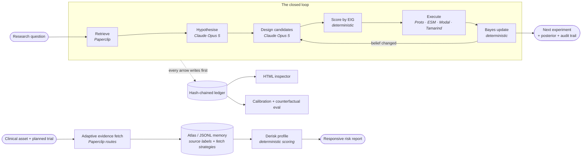

<div align="center">

# Probception

### An AI scientist that shows its work as probabilities — it states what it believes, how sure it is, and runs the experiment most likely to prove itself wrong.

[](#)
[](#)
[](#)
[](#)
[](#)

**[Quickstart](#quickstart-90-seconds) · [How it works](#how-it-works) · [Phase 2](#phase-2-memory-and-paperclip) · [Why it wins](#how-this-maps-to-the-judging-criteria) · [Setup](docs/SETUP.md)**

</div>

---

## The one-line pitch

> Most AI research agents give you an answer. **Probception gives you a probability, the evidence behind it, and the single next experiment most likely to change its mind.**

The hackathon product is now focused: **clinical asset derisking for in vivo
CRISPR, especially LNP-delivered editing assets.** Input a clinical asset plus
planned trial design; get a renderable risk profile with safety, efficacy,
confidence, FDA approval, and commercial-success scores.

## The problem, in plain English

Ask a normal AI agent a scientific question and it writes you a confident paragraph. You cannot tell which parts it actually knows, which parts it guessed, or what would have made it say something different. So you cannot trust it, and you certainly cannot act on it.

Real scientists do not work that way. A real scientist holds several competing explanations at once, assigns each a rough plausibility, and then designs the cheapest experiment that would tell those explanations apart. When the result lands, they update — and the *next* experiment they run is different because of it.

**Probception is that behaviour, made mechanical and auditable.**

## The same thing, in technical English

Probception is a **Bayesian optimal-experimental-design agent**. It maintains an explicit posterior over a set of falsifiable hypotheses. At each step it enumerates candidate experiments, computes each one's **expected information gain**

$$\text{EIG}(e) = H(\text{belief}) - \mathbb{E}_{o \sim P(o)}\big[H(\text{belief} \mid o)\big]$$

selects $\arg\max_e \text{EIG}(e)/\text{cost}(e)$, executes it against **data it has not seen**, and applies Bayes' rule. Every step — retrieval, hypothesis, prediction, score, observation, update — is written to a **hash-chained append-only ledger** before it takes effect, so any run can be replayed, graded, and audited from disk with no live model in the loop.

The scientific domain is a plug-in. The reasoning core does not care whether an
"experiment" is a literature query, a protein design job on Modal, an ESM
embedding sweep, or a wet-lab assay someone runs on Monday. The clinical product
sits beside that loop: it gathers trial and paper evidence, writes source-labeled
memory, and computes deterministic risk scores without letting the LLM adjust the
math.

---

## Quickstart (90 seconds)

No API keys needed. The whole loop runs offline.

```bash
git clone https://github.com/sameernagar-hub/probception && cd probception
uv sync --extra dev
uv run probception doctor
uv run probception demo
```

Then the part that matters:

```bash
uv run probception counterfactual
```

That last command runs **the identical agent against two worlds whose experiments return opposite results**, and diffs what it proposes next. If the agent proposes the same experiment regardless of the data, this command **fails with exit code 1** and says so. That is the test we could most easily have hidden, so we made it the headline demo.

The finalized hackathon vertical is clinical asset derisking for in vivo CRISPR:

```bash
uv run probception risk-profile "VERVE-102 PCSK9 GalNAc-LNP" \
  "Phase 1b/2 single ascending dose in HeFH or premature CAD; endpoints: safety, PCSK9, LDL-C"
```

That produces a deterministic risk profile plus a standalone responsive HTML
report: safety and efficacy scores across cell, animal, and human evidence;
confidence; FDA approval proxy; commercial success proxy; and the agent-facing
reasoning trail. The current comparator set is Casgevy, VERVE-101, VERVE-102,
and NTLA-2001.

Phase 2 starts by importing the science team's Phase 1 review sheet into compact
agent memory. With MongoDB Atlas configured, this writes Atlas records; without
it, the same command falls back to `.probception_memory/memory.jsonl`.

```bash
uv run probception ingest-phase1
```

The local Paperclip MCP bridge is the Phase 2 data loop:

```bash
uv run python scripts/paperclip_mcp.py
```

It can fetch fresh trial/paper evidence on demand, then remember the source
routes that worked so later agents search better.

Full setup for macOS, Windows, and Linux: **[docs/SETUP.md](docs/SETUP.md)**

---

## How it works



**The load-bearing design decision:** the LLM proposes, but it never scores and it never updates. Claude generates hypotheses and candidate experiments — the creative work it is genuinely good at. The *selection* of which experiment to run and the *revision* of belief are pure, deterministic, unit-tested arithmetic. That split is why the agent's behaviour is reproducible and why a wrong answer is always traceable to either a bad hypothesis or a bad likelihood, never to an unexaminable vibe.

### What each layer does

| Layer | Module | Responsibility | LLM involved? |
|---|---|---|---|
| **Evidence** | `adapters/` | Retrieve papers, datasets, trials, assay results as content-addressed `Evidence` | no |
| **Clinical derisking** | `clinical.py` | Score in vivo CRISPR asset risk from trial evidence and hardcoded rubric | no |
| **Phase 2 memory** | `memory.py` / `phase2.py` | Store Phase 1 rubric rows, source labels, evidence snippets, and fetch strategies | no |
| **MCP bridge** | `scripts/paperclip_mcp.py` | Expose Paperclip search, clinical trial gathering, asset-context retrieval, and memory upserts | no |
| **Hypothesis** | `agents/scientist.py` | Turn a question into 3–5 competing falsifiable claims with priors | **yes** |
| **Design** | `agents/scientist.py` | Propose candidate experiments with full `P(outcome \| hypothesis)` tables | **yes** |
| **Selection** | `design/eig.py` | Compute EIG, rank by information per unit cost, choose | no |
| **Execution** | `adapters/` | Run the chosen experiment against unseen data | no |
| **Inference** | `belief/state.py` | Bayes update, entropy, surprise | no |
| **Provenance** | `trace/` | Hash-chained ledger + standalone HTML inspector | no |
| **Validation** | `eval/` | Calibration (Brier), counterfactual replay, ablation | no |

---

## How this maps to the judging criteria

| Criterion | What we built | Command that demonstrates it |
|---|---|---|
| **Closing the loop** — *does the agent analyse data it hasn't seen and propose a next experiment that changes when the results change?* | Held-out execution via adapters the agent cannot inspect, plus a **counterfactual replay harness** that runs the same agent across contradictory worlds and diffs the proposal. Belief divergence is reported as a number; an unresponsive loop exits non-zero. | `probception counterfactual` |
| **Inspectability** — *can the agent reconstruct why it made its decisions?* | Append-only **hash-chained ledger**: every candidate considered (not just the winner), its EIG, its cost, the prediction made *before* the result, the observation, the surprise in bits, and the before/after posterior. Rendered to a zero-dependency HTML inspector. Tampering is detectable. | `probception report <run>`<br>`probception verify <run>` |
| **Validation** | Predictions are recorded before outcomes arrive, so **Brier score and log score** are computed from the ledger alone against an uninformed baseline. The deterministic reasoner is a built-in **ablation arm**: swap out the LLM and measure how much of the result came from the model versus the Bayesian machinery. | `probception score <run>`<br>`probception ask "..." --offline` |
| **Creative use of the tools** | Paperclip is an evidence layer plus an adaptive fetch loop: it searches trials, FDA, PMC, arXiv, bioRxiv, medRxiv, and OpenAlex-style routes, then stores `fetch_strategy` records so later agents refine the search. Proto/ESM/Tamarind runs are treated as **experiments with pre-declared outcome thresholds** recorded before submission. Modal is the execution substrate. Claude does hypothesis generation under a strict falsifiability contract with structured outputs and prompt caching. | [docs/INTEGRATIONS.md](docs/INTEGRATIONS.md)<br>[docs/PHASE2_MEMORY.md](docs/PHASE2_MEMORY.md) |
| **Hackathon product focus** | In vivo CRISPR clinical asset derisking: input an asset plus planned trial design; output a risk profile with safety, efficacy, confidence, FDA, and commercial-success scores. Integrations have deterministic fallbacks so the demo survives failed APIs. | `probception risk-profile ...`<br>`probception ingest-phase1` |

**The claim we are willing to be tested on:** an experiment whose result you can already predict is worth zero bits, no matter how expensive or impressive it looks. Probception will refuse to rank it highly, and the ledger shows exactly why.

---

## What you actually see in a demo

```
Step 1 — candidates scored by information gain
┏━━━━━━━━━━━━━━━━━━━━━━━━━━━━━━━━━━━┳━━━━━━━┳━━━━━━┳━━━━━━━━┓
┃ Experiment                        ┃   EIG ┃ Cost ┃ Utility┃
┡━━━━━━━━━━━━━━━━━━━━━━━━━━━━━━━━━━━╇━━━━━━━╇━━━━━━╇━━━━━━━━┩
│ Negative control panel <-- chosen │ 0.183 │  1.0 │  0.183 │
│ High-power replication            │ 0.331 │  3.0 │  0.110 │
│ Dose-response series              │ 0.402 │  4.0 │  0.100 │
│ Orthogonal readout                │ 0.438 │  5.0 │  0.088 │
└───────────────────────────────────┴───────┴──────┴────────┘
  observed positive | surprise 0.93 bits | entropy 1.943 -> 1.807
```

Note what happened there: the agent did **not** pick the highest-information experiment. It picked the one with the best information *per unit cost* — which is what a scientist with a finite budget actually does, and which you can only justify if you have both numbers written down.

---

## Tech stack

**Reasoning** — Claude Opus 5 (`claude-opus-5`) via the Anthropic Messages API, using structured outputs for typed hypothesis/experiment generation, prompt caching on the stable system prefix, and configurable `effort`.

**Core** — Python 3.11+ · Pydantic v2 (every contract is a validated model) · NumPy · Typer + Rich (CLI) · httpx (adapters) · pytest + Ruff.

**Scientific tooling** — GXL Paperclip (evidence) · Proto (biological design) · Modal (compute) · ESM / Boltz (representations and structure) · Tamarind (hosted jobs) · Benchling (LIMS + MCP) · Phylo/Biomni.

**Memory** — MongoDB Atlas/vector search when configured · deterministic JSONL
fallback when not · hash embeddings for offline retrieval · source labels to
compress repeated context.

**Fallback stance** — live integrations are optional accelerators. Paperclip SDK,
Paperclip CLI, hosted MCP, Proto, Modal, Tamarind, and Phylo can all fail without
taking the demo down; the system falls back to deterministic seed trials, mock
evidence, or a scripted lab while preserving the failure reason in metadata.

**Phase 2 memory** — MongoDB Atlas/vector search is used when configured;
otherwise the same MCP tools fall back to deterministic JSONL memory under
`.probception_memory/`. Memory stores source context and labels only. It never
sets scores, ranks experiments, or updates beliefs.

**Deliberately kept small** — no web framework and no orchestration library. The
core ledger is still JSONL and the inspector is still one self-contained HTML
page. Atlas is optional memory, not a requirement for the demo.

Full integration notes, credit redemption, and rate limits: **[docs/INTEGRATIONS.md](docs/INTEGRATIONS.md)**

---

## Repository map

```
probception/
├── src/probception/
│   ├── types.py            # Every contract, as a Pydantic model
│   ├── clinical.py         # Clinical asset derisking risk profile
│   ├── memory.py           # Phase 2 retrieval cache + deterministic embeddings
│   ├── phase2.py           # Phase 1 sheet ingestion and memory preparation
│   ├── belief/state.py     # Bayes, entropy, surprise — pure and tested
│   ├── design/eig.py       # Expected information gain, cost-adjusted ranking
│   ├── agents/
│   │   ├── llm.py          # Claude wrapper: structured outputs, caching, tracing
│   │   └── scientist.py    # LLM reasoner + deterministic ablation arm
│   ├── adapters/           # Paperclip, Proto, Google Sheet, Tamarind, mock/scripted I/O
│   ├── trace/              # Hash-chained ledger + standalone HTML inspector
│   ├── eval/               # Calibration + the counterfactual harness
│   ├── loop.py             # The closed loop
│   └── cli.py              # doctor / demo / ask / risk-profile / ingest-phase1 / counterfactual / score / verify
├── data/                   # Versioned Phase 1 regulatory review-map seed files
├── tests/                  # Belief, EIG, memory, ledger integrity, end-to-end loop
└── docs/                   # Setup, phase memory, integrations, architecture, logs
```

---

## Commands

| Command | What it does |
|---|---|
| `probception doctor` | Check Python, packages, and which credentials are present. **Run this first.** |
| `probception demo` | Full closed loop on a built-in question. No API key required. |
| `probception ask "<question>"` | Run the loop on your own question. |
| `probception risk-profile "<asset>" "<trial design>"` | Produce the in vivo CRISPR clinical asset risk profile and responsive report. |
| `probception ingest-phase1` | Fetch the Phase 1 Google Sheet rubric and write Phase 2 memory records. |
| `python scripts/paperclip_mcp.py` | Start the local MCP bridge for Paperclip search, trial gathering, adaptive fetch memory, and scoring. |
| `probception counterfactual` | The closing-the-loop proof. Exits non-zero if the loop is open. |
| `probception score <run-id>` | Calibration (Brier, log score, top-1) from the ledger alone. |
| `probception report <run-id>` | Rebuild the standalone HTML inspector. |
| `probception verify <run-id>` | Re-walk the hash chain to prove the ledger was not edited. |
| `probception runs` | List runs on this machine. |

---

## Phase 2 Memory And Paperclip

Phase 2 turns the science team's review rubric and Paperclip results into
reusable memory without breaking the core rule that the LLM never scores or
updates beliefs.

What is live now:

- The Phase 1 Google Sheet is normalized into 12 FDA review domains under
  `data/phase1_regulatory_review_map.csv` and `.json`.
- `probception ingest-phase1` writes those domains to Atlas if `MONGODB_URI` is
  configured, or local JSONL memory if it is not.
- The MCP tool `collect_clinical_asset_evidence` searches Paperclip routes for
  trials, FDA, PMC, arXiv, bioRxiv, medRxiv, and OpenAlex-style evidence.
- Each fetch stores both the evidence snippet and a `fetch_strategy` record.
  Later calls retrieve those strategies and refine queries with stable hints
  such as off-target, biodistribution, immunogenicity, dose-response, LDL-C,
  PCSK9, liver, and LNP.
- Memory is retrieval only. It can help the agent look in better places; it
  cannot change deterministic scores, experiment rankings, outcome labels, or
  belief updates.

---

## The team

Six people, re:AGENT, 2 Marina Boulevard, Building C.

| | Focus |
|---|---|
| **Stephen** | _—_ |
| **Anjane** | _—_ |
| **Kanishk** | _—_ |
| **Chaitra** | _—_ |
| **Kent** | _—_ |
| **Sameer** | _—_ |

Phase 2 coordination now happens through source-labeled memory collections, MCP
tool outputs, and the execution log, not a shared coordination doc.

---

## Documentation

| Doc | Read it when |
|---|---|
| **[SETUP.md](docs/SETUP.md)** | You are setting up a laptop (macOS / Windows / Linux) |
| **[ARCHITECTURE.md](docs/ARCHITECTURE.md)** | You want the design rationale and the extension points |
| **[CLINICAL_DERISKING.md](docs/CLINICAL_DERISKING.md)** | You are working on the in vivo CRISPR risk-profile product |
| **[PHASE2_MEMORY.md](docs/PHASE2_MEMORY.md)** | You are wiring the Phase 1 sheet, MCP tools, and persistent agent memory |
| **[REGULATORY_EVIDENCE_MAP.md](REGULATORY_EVIDENCE_MAP.md)** | You are mapping FDA benefit-risk evidence for gene-editing applications |
| **[INTEGRATIONS.md](docs/INTEGRATIONS.md)** | You are wiring up Paperclip / Proto / Modal / Benchling |
| **[EXECUTION_LOG.md](docs/EXECUTION_LOG.md)** | You want to know what happened when, and what we decided |
| **[CHANGELOG.md](CHANGELOG.md)** | You want the shipped-feature history |
| **[CREDITS.md](docs/CREDITS.md)** | Attribution for every tool, sponsor, and dependency |

---

## Status

**Phase 2 ready.** The reasoning core, belief math, EIG planner, ledger,
inspector, evaluation harness, clinical derisking workflow, Paperclip MCP bridge,
adaptive evidence fetching, Atlas/JSONL memory, deterministic fallbacks, CLI, and
test suite are done and green. The current product input is a clinical asset plus
planned trial design; the output is a renderable risk profile for in vivo CRISPR,
focused on LNP delivery.

Next up: science-team review of clinical asset labels, hardcoded rubric
validation, Claude skill generation, and Phase 3 processing over the accumulated
memory/evidence set.

---

<div align="center">

Built at **re:AGENT** · August 15–16, 2026 · GXL · Arc Institute · Anthropic · Founders Inc

MIT licensed. Take it, fork it, point it at your own science.

</div>
